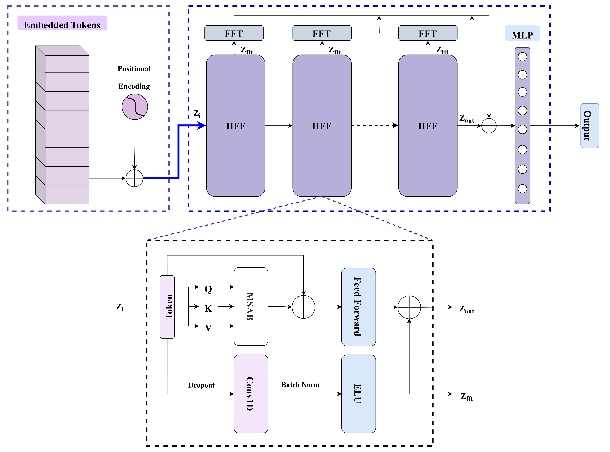
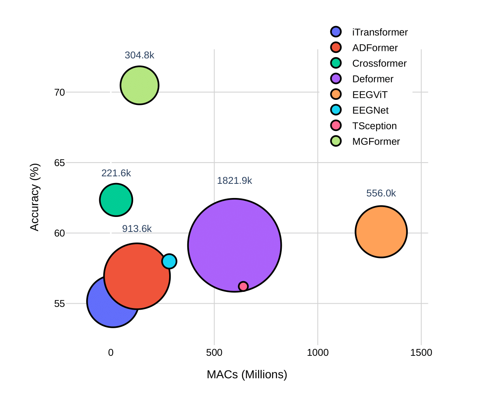
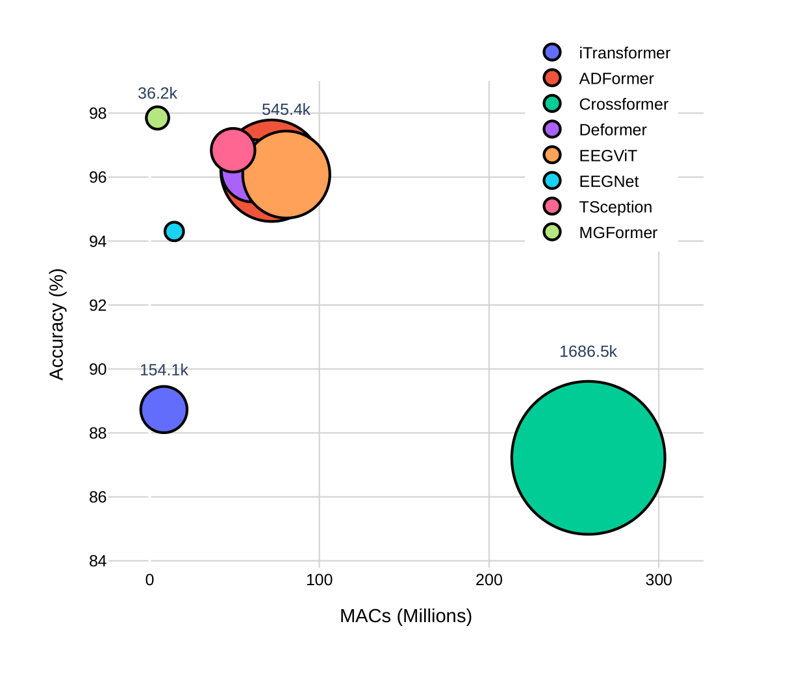
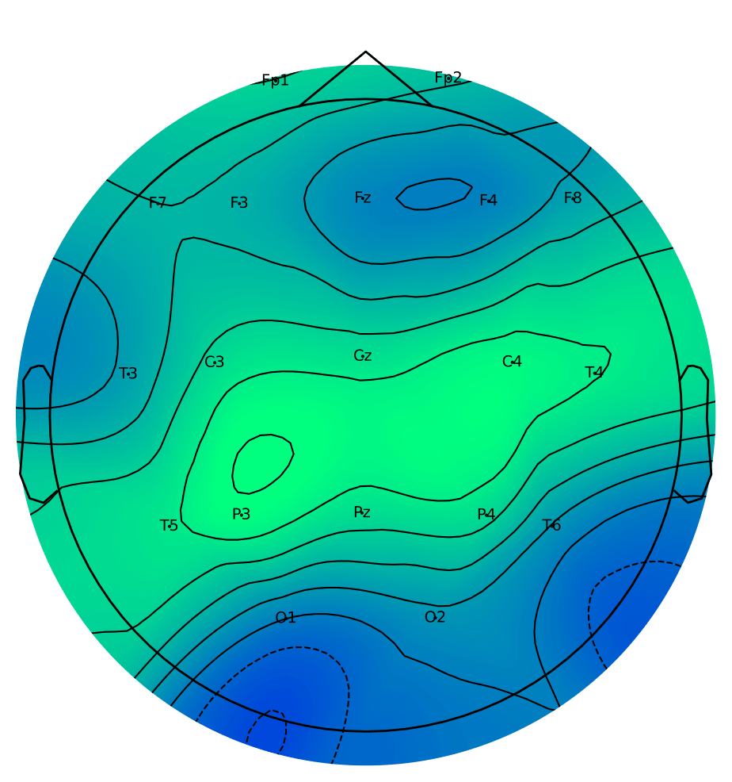
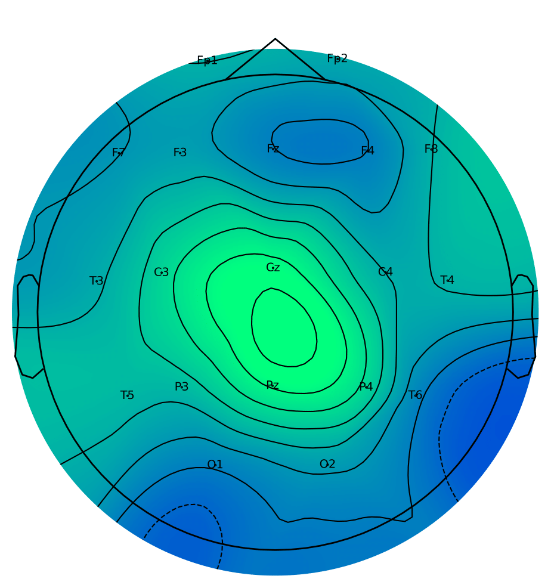

# MGFormer 🧠 — Multi-Granular Transformer for EEG-based Alzheimer's Detection

**MGFormer** is a lightweight hybrid model combining CNN, Transformer, and frequency-domain analysis to classify Alzheimer's Disease from EEG signals. It is optimized for subject-independent setups, enabling real-world applicability.

<!--  📌 REPLACE with architecture figure from the paper -->

---
## Dataset Link
- **AUT-AD** -- https://openneuro.org/datasets/ds004504/versions/1.0.8
- **FSU-AD** -- https://osf.io/s74qf/


## 🔬 Overview

Alzheimer’s Disease (AD) affects brain activity in subtle ways. EEG is a cost-effective and non-invasive modality for early AD detection. MGFormer offers:

- **Multi-Granular Token Encoding (MgTE)** — temporal convolutions with multiple kernel sizes to extract localized dynamics.
- **Hybrid Feature Fusion (HFF)** — combines self-attention, 1D CNNs, and FFT-based spectral features.
- **Subject-Independent Generalization** — designed to work on entirely unseen subjects for robust clinical utility.

---

## 🧱 Architecture

MGFormer consists of two main components:

### 1. Multi-Granular Token Encoder (MgTE)
Extracts temporal features at multiple scales, then applies spatial convolution across EEG channels.

 <!-- 📌 Insert Figure 2 from the paper -->

### 2. Hybrid Feature Fusion (HFF)
Each Transformer layer is extended with:
- Multi-head self-attention
- 1D convolution for fine-grained temporal features
- FFT feature extraction for spectral context

 <!-- 📌 Insert Figure 3 from the paper -->

---

## 📊 Performance

### Datasets:
- **FSU-AD**: 128Hz EEG, 19 channels, binary AD vs HC
- **AUT-AD**: 500Hz EEG, 19 channels, denoised, bandpass-filtered

### Accuracy:
| Dataset  | Accuracy | F1-Score | AUROC |
|----------|----------|----------|--------|
| AUT-AD   | **70.48%** | **70.50%** | 78.51% |
| FSU-AD   | **97.85%** | **97.84%** | 99.74% |

 <!-- 📌 Insert Figure 4 from the paper -->


---

## 🧪 Ablation Studies

| Variant              | AUT-AD Accuracy | FSU-AD Accuracy |
|----------------------|------------------|------------------|
| w/o FFT Features     | 68.98%           | 98.23%           |
| w/o 1D-CNN in HFF    | 60.57%           | 97.97%           |

---

## 🖼️ Saliency Maps

Visual explanation using Grad-CAM shows MGFormer attends to known AD-affected regions.

 <!-- 📌 Insert Figure 5a/c -->
 <!-- 📌 Insert Figure 5b/d -->

---

## ⚙️ How to Run

```bash
git clone https://github.com/Raiyan78/MGformer.git
cd MGformer
pip install -r requirements.txt
python train.py --dataset fsu-ad --model mgformer
